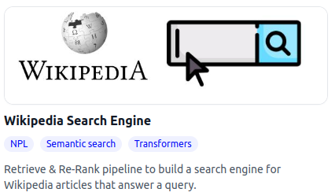
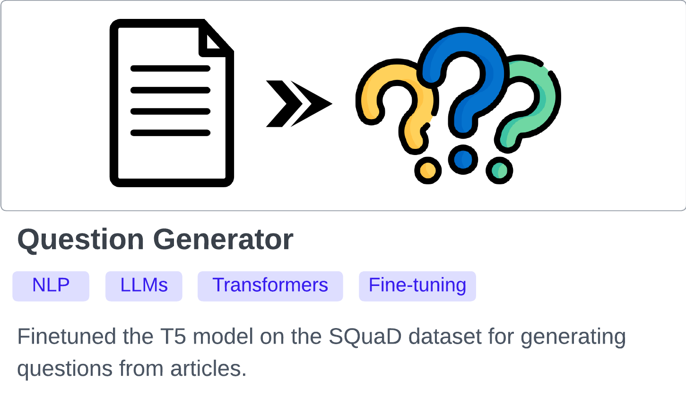

## Portfolio

 

## Medium articles
<li><a href="https://towardsdatascience.com/4-ways-to-encode-categorical-features-with-high-cardinality-1bc6d8fd7b13" target="_blank"><b>4 Ways to Encode Categorical Features with High Cardinality — with Python Implementation</b></a> <i>Learn to apply target encoding, count encoding, feature hashing and Embedding using scikit-learn and TensorFlow</i></li>

## Where to find me
 
